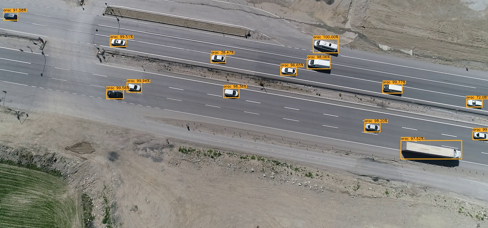

<p align="center"></p>

<h1 align="center">Keras RetinaNet for Teknofest 2019 AI Competition</h1>
<p>Using RetinaNet for object detection from drone images in Teknofest istanbul 2019 Artificial Intelligence Competition</p>


##### Teknofest 2019 - Yapay Zeka Yarışması:
TEKNOFEST 2019 Yapay Zeka Yarışması kapsamında takımlar bir drone ile önceden kaydedilmiş görüntüler üzerinden nesne tespiti yapacaklardır. Drone uçuş  manevraları ve görüntünün odaklandığı yerler ile alçak irtifada hareket eden bir hava aracından görülen görüntüleri temsil edecektir. Yarışma  esnasında  test  amaçlı  kullanılacak  videolar, önceden etiketlenmiş  olacak, yarışmacılar verilen süre içerisinde ne kadar doğru tespit yaptıklarına göre puanlandırılacaklardır.


<h2 align="center">:clipboard: Başlangıç Kılavuzu (Getting Started)</h2>

### :dvd: Ön Koşullar (Software Prerequisites)

- keras
- keras-resnet
- tensorflow
- numpy
- opencv
- json
- tqdm

### :blue_book: Klasör Yapısı (Folder Structure)

```
main_dir
- dataset_test
- retinanet
    - keras_retinanet ([source](https://github.com/fizyr/keras-retinanet/tree/master/keras_retinanet))
    - models
        - teknofest19_huma_resnet50_21_37_inference.h5
    - snapshots
        - teknofest19_huma_resnet50_21_37_ss.h5
    - results
    - detect_all_images.py
```

<h2 align="center">:hourglass: Eğitim (Train)</h2>

RetinaNet'in Keras implementasyonuna ve eğitim dökümanına [buradan](https://github.com/fizyr/keras-retinanet) ulaşabilirsiniz.

Drone ile çekilmiş yaklaşık 30bin görüntü üzerinden etiketlenmiş araç ve insan veri kümesi ile 58 epoch eğitilmiş ResNet-50 RetinaNet snapshot dosyasını [buradan](https://drive.google.com/open?id=1TUQCY4dHaW2YZ6ymNyk9PsDbJQsm0xJR) indirebilirsiniz.


<h2 align="center">:watch: Test</h2>

Önceden eğitilmiş ve dönüştürülmüş model dosyası olan ```teknofest19_huma_resnet50_21_37_inference.h5``` dosyasını [buradan](https://drive.google.com/open?id=1TUQCY4dHaW2YZ6ymNyk9PsDbJQsm0xJR) indirerek retinanet klasörü altında models klasörü altına kopyalayınız.

Test yapabilmeniz için örnek test görüntülerini [buradan](https://drive.google.com/open?id=1Pfjk-YS2-GPd-JxuXHgk2DAHjD05Tamx) indererek ```dataset_test``` klasörü altına kopyalayınız.

Eğitilmiş model ile ```dataset_test``` klasöründeki resimler üzerinde nesne tespiti yapmak için ```detect_all_images.py``` python programını çalıştırabilirsiniz.
Tahmin (prediction) sonuçlarını ```results``` klasörü altına resmin üzerine çizilmiş şekilde çıkartılacaktır.

<h2 align="center">:watch: Sonuçlar (Results)</h2>
<p align="center"></p>

<h2 align="center">:alien: Contact (İletişim)</h2>

* [Takım Web Sitesi](https://huma-teknofest.github.io/)
* [E-posta Adresi](huma.teknofest@gmail.com)


